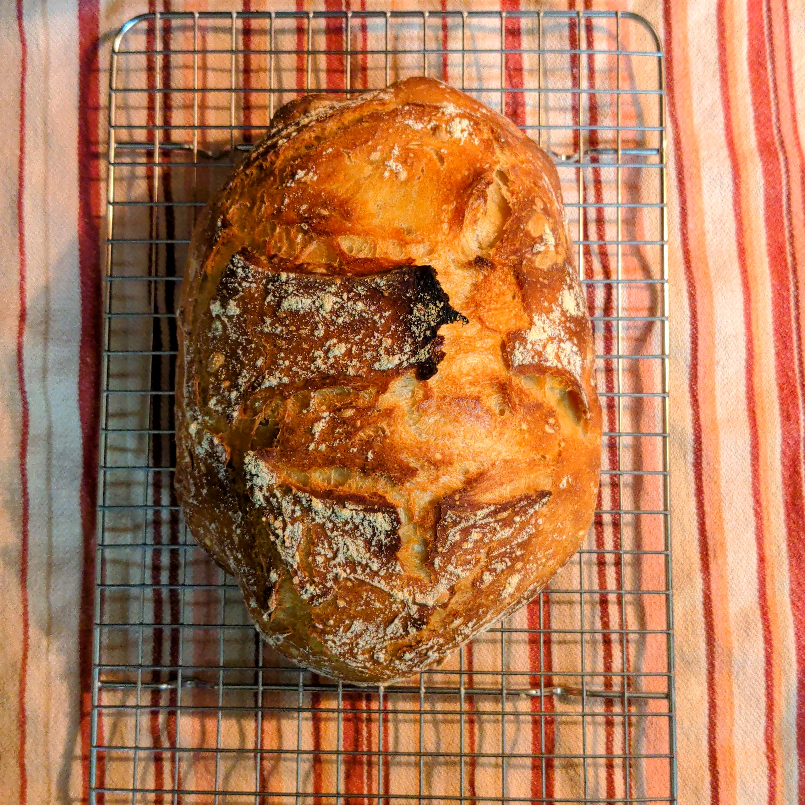

### TL;DR

☕ Software Developer

👨🏻 He/Him

🐧 Passionate about Open Source Software

🍳 Aspiring Home Chef

🧙🏼‍♂️ Dungeon Master Extroardinaire

### About Me

I'm a software developer looking to use my powers for good. With a focus on privacy, security, and accessibility, I strive to create free applications that are high-quality, user-empowering, and sustainable. In addition, I'm a big proponent of being **more** than just your job description.

Outside the computing world, you'll often find me in the kitchen or behind the DM screen1. One of my hobbies is creating new dishes as "from scratch" as possible. If you're ever a player in one of my Dungeons and Dragons games, you're guaranteed to have some homemade snacks waiting for you!

Here's a picture of one of my most photogenic loaves of bread 😋

### What I'm Working On

Right now, I'm not working on any significant side projects. But I've been sharpening my skills with Golang with the [Daily Coding Problem](https://www.dailycodingproblem.com/) newsletter, which I highly recommend for anyone in software development.

Thanks for scrolling through all this!

That's all for now, folks!

### Footnotes
1. This is a term used in tabletop role-playing games (such as Dungeons and Dragons) to describe a tool utilized by the "Dungeon Master". Read more about it [here (wikipedia.org)](https://wikipedia.org/wiki/Gamemaster%27s_screen).